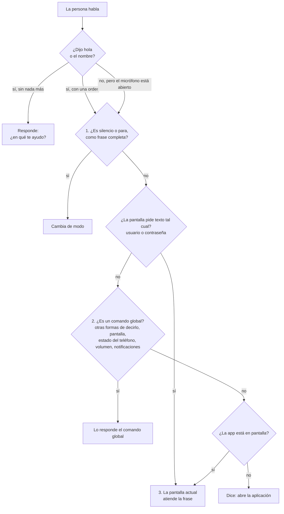

# Cómo funciona la voz

> Vigente · Dueño: Equipo 1 (Pp) · Verificado el 28 sep 2026 contra integracion/actividades en 8019dd1

Toda la app usa un solo motor de voz, `VoiceEngine` (`core/voice/VoiceEngine.kt`), porque Android solo permite un reconocedor y una síntesis de voz confiables por proceso. Ninguna pantalla crea el suyo: todas escuchan las frases que el motor les pasa.

## Los tres modos

| Modo | Cómo se entra | Qué hace | Cómo se sale |
| --- | --- | --- | --- |
| Activo | Al abrir la app | Habla y escucha | "Silencio" o "para" |
| Silencio | "silencio", "espera", "un momento"... | Calla, pero sigue atento a "hola" o al nombre del asistente | "Hola" o su nombre |
| Detenido | "para", "detente", "adiós"... | No hace nada | Volver a abrir la app, o el botón "Detener" del aviso fijo |

Las frases exactas están en la [decisión 0006](../decisiones/0006-silencio-y-para.md).

## Recorrido de una frase

1. **Control.** "Silencio" y "para" se atienden primero y funcionan sin decir "hola" (`VoiceEngine.handleControl`).
2. **Comandos globales.** Se atienden en `GlobalVoiceCommands`, en este orden: otras formas de decirlo, pantalla y brillo, estado del teléfono, volumen y notificaciones. La pantalla va antes que lo demás para que la salida de la pantalla negra funcione siempre.
3. **Pantalla.** Si nadie la atendió, la frase llega al ViewModel de la pantalla abierta.

Cuando una pantalla pide el usuario o la contraseña, se salta el paso 2 para que la frase llegue sin cambios (`rawInput`). "Silencio" y "para" siguen funcionando.

## Tolerancia a errores

`VoiceText` (`core/voice/VoiceText.kt`) quita acentos y mayúsculas y compara por palabras completas ("menudo" no es "menú"). Perdona una letra mal en palabras largas y una palabra partida en dos: "isquierda" cuenta como "izquierda" y "en frente" como "enfrente". Las palabras reales que están a una letra de un comando solo cuentan si se dicen exactas.

## La IA

Si nadie entendió la frase y la IA está encendida, la frase podría ir a `IntentFallback.resolver`. Hoy la IA está apagada por defecto y sin conectar ([decisión 0002](../decisiones/0002-ia-apagada-por-defecto.md)).
